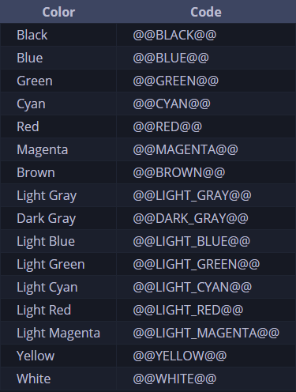

# Rewrite
Rewritten 5/7/2022
# Documentation
## `library:Init(clear, consoleName)`
**Method**

| Arguments     | Usage                         | Type   | Default   | Optional |
| ------------- | ----------------------------- | ------ | --------- | -------- |
| clear         | Clears console when executed. | Bool   | **N/A**   | ❌      |
| consoleName   | Sets Console Name             | String | "Console" | ✔️      |

## `console:clear(clearMessage, color, crename)`
**Method**

| Arguments    | Usage                                                                                                             | Type   | Default               | Optional | 
| ------------ | ----------------------------------------------------------------------------------------------------------------- | ------ | --------------------- | -------- |
| clearMessage | Message sent when console is cleared.                                                                             | String | `nil`                 | ✔️      |
| Color        | Color for the new message created. [List of Colors Available](https://github.com/RobloxArchiver/Console#colors)   | String | White                 | ✔️      |
| CRename      | Renames console.                                                                                                  | String | Default (ConsoleName) | ✔️      |

## `console.log(text, color)`
**Function**

| Arguments | Usage                                                                                           | Type   | Default   | Optional |
| --------- | ----------------------------------------------------------------------------------------------- | ------ | --------- | -------- |
| text      | Sets the Text Used.                                                                             | String | **N/A**   | ❌      |
| color     | Sets the Color. [List of Colors Available](https://github.com/RobloxArchiver/Console#colors)    | String | "WHITE"   | ✔️      |

## `console.warn(text)`
**Function**

| Arguments | Usage               | Type   | Default   | Optional |
| --------- | ------------------- | ------ | --------- | -------- |
| text      | Sets the Text Used. | String | **N/A**   | ❌      |

## `console.info(text)`
**Function**

| Arguments | Usage               | Type   | Default   | Optional |
| --------- | ------------------- | ------ | --------- | -------- |
| text      | Sets the Text Used. | String | **N/A**   | ❌      |

## `console.error(text)`
**Function**

| Arguments | Usage               | Type   | Default   | Optional |
| --------- | ------------------- | ------ | --------- | -------- |
| text      | Sets the Text Used. | String | **N/A**   | ❌      |

# Starting
To begin add this to the top of your script. 
```lua
local library = loadstring(game:HttpGet("https://raw.githubusercontent.com/RobloxArchiver/Console/main/src/main.lua"))();
local console = library:Init(true, "Test!"); --> You can keep the 2nd arg empty, it'll default to "Console."

console.log("Test", "blue");
```

Optionally to keep the loader in one line feel free to use it like this.
```lua
local console = loadstring(game:HttpGet("https://raw.githubusercontent.com/RobloxArchiver/Console/main/src/main.lua"))():Init(true, "Test!");

console.log("Test", "blue");
```

# Colors
Taken out of Synapse X Documentation Note: No need to capitalize as show in docs, it is handled for you! 



